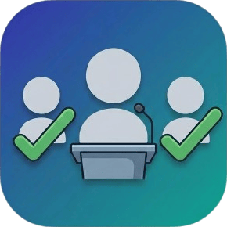

<p align="center">
  
</p>

<h1 align="center">BluMark</h1>

<p align="center">
  <strong>🔷 Bluetooth-Powered Smart Attendance System</strong>
</p>

<p align="center">
  <em>Automate classroom attendance with BLE beacons, real-time sync, and AR head counting</em>
</p>

<p align="center">
  
  
  
  
  
  
</p>

---

## 📖 About

**BluMark** is a Flutter-based mobile application that revolutionizes classroom attendance using **Bluetooth Low Energy (BLE)** technology. Faculty members broadcast an attendance session as a BLE beacon — students simply open the app, scan, and their attendance is marked automatically. Everything syncs in real-time with a **Supabase** cloud backend.

> No manual roll calls. No proxy attendance. No paper.

---

## ✨ Features

| Feature | Description |
|---------|-------------|
| 📡 **BLE Attendance** | Faculty devices broadcast sessions as Bluetooth beacons; students scan to check in |
| 👥 **Role-Based Access** | Dedicated dashboards for **Admin**, **Faculty**, and **Student** |
| ☁️ **Real-Time Sync** | Instant cloud synchronization via Supabase Realtime |
| 🔍 **Multi-Strategy Scanning** | 4 BLE scan modes for broad Android device compatibility |
| 🧠 **AR Head Counting** | Count students via camera using Google ML Kit face detection with 180° sweep support |
| 📱 **Cross-Platform** | Built with Flutter — runs on both Android and iOS |

---

## 🏗️ Architecture

```
┌─────────────────────────────────────────────────────────────────┐
│                         BluMark App                             │
├─────────────────────────────────────────────────────────────────┤
│  ┌──────────────┐  ┌──────────────┐  ┌──────────────┐           │
│  │    Admin     │  │   Faculty    │  │   Student    │           │
│  │  Dashboard   │  │  Dashboard   │  │  Dashboard   │           │
│  └──────┬───────┘  └──────┬───────┘  └──────┬───────┘           │
│         │                 │                 │                   │
│         ▼                 ▼                 ▼                   │
│  ┌──────────────────────────────────────────────────────────┐   │
│  │                     Services Layer                       │   │
│  │  ┌────────────────┐  ┌──────────────────┐  ┌──────────┐  │   │
│  │  │ BluetoothService│ │ SupabaseService  │  │Permission│  │   │
│  │  │  (BLE Central/  │ │  (Database +     │  │ Service  │  │   │
│  │  │   Peripheral)   │ │   Realtime)      │  │          │  │   │
│  │  └────────────────┘  └──────────────────┘  └──────────┘  │   │
│  └──────────────────────────────────────────────────────────┘   │
│                              │                                  │
└──────────────────────────────┼──────────────────────────────────┘
                               │
                               ▼
                    ┌─────────────────────┐
                    │      Supabase       │
                    │  ┌───────────────┐  │
                    │  │   student     │  │
                    │  │   faculty     │  │
                    │  │   session     │  │
                    │  │  attendance   │  │
                    │  │    admin      │  │
                    │  └───────────────┘  │
                    └─────────────────────┘
```

---

## 🔄 How It Works

### Faculty Flow
```
📱 Login ──▶ 📋 Configure Session ──▶ 📡 Start BLE Broadcast
                                              │
                 End Session ◀── 👀 Monitor ◀─┘
                     │            Real-Time
                     ▼            Check-ins
              🛑 Stop Beacon
```

1. Faculty logs in and opens the **Faculty Dashboard**
2. Configures session details — date, hour, department, batch, year
3. Starts the session → device broadcasts a **BLE beacon** with a unique token
4. Students check in by scanning → attendance list updates in **real-time**
5. Faculty ends session → BLE broadcast stops, session marked inactive

### Student Flow
```
📱 Login ──▶ 🔍 Scan for Sessions ──▶ ✅ Attendance Marked!
```

1. Student logs in and opens the **Student Dashboard**
2. Taps **"Scan for Attendance"** — app scans for nearby BLE beacons
3. On detecting the faculty's beacon, attendance is **automatically marked** in Supabase
4. Confirmation is shown to the student

---

## 🛠️ Tech Stack

| Layer | Technology | Purpose |
|-------|-----------|---------|
| **Framework** | Flutter (Dart) | Cross-platform UI |
| **BLE Central** | `flutter_blue_plus` | Scanning for beacons |
| **BLE Peripheral** | `ble_peripheral` | Broadcasting beacons |
| **Backend** | Supabase (PostgreSQL + Realtime) | Database, auth & real-time sync |
| **AR/ML** | `google_mlkit_face_detection` | Head counting via camera |
| **Camera** | `camera` | Live camera feed for face detection |
| **Storage** | `shared_preferences` | Local session persistence |
| **Permissions** | `permission_handler` | Runtime permission management |
| **IDs** | `uuid` | Unique token generation |

---

## 📁 Project Structure

```
lib/
├── main.dart                         # App entry, routing, Supabase init
├── models/
│   ├── admin.dart                    # Admin data model
│   ├── attendance.dart               # Attendance record model
│   ├── faculty.dart                  # Faculty data model
│   ├── session.dart                  # Session model
│   └── student.dart                  # Student data model
├── screens/
│   ├── login_screen.dart             # Unified login for all roles
│   ├── admin/
│   │   └── admin_dashboard.dart      # Admin management panel
│   ├── faculty/
│   │   ├── faculty_dashboard.dart    # Session management & BLE broadcast
│   │   └── head_counting_screen.dart # AR face detection head counter
│   └── student/
│       └── student_dashboard.dart    # Attendance scanning UI
├── services/
│   ├── bluetooth_service.dart        # BLE scanning & advertising logic
│   ├── permission_service.dart       # Runtime permission handling
│   └── supabase_service.dart         # DB operations & realtime subscriptions
└── utils/
    ├── constants.dart                # Supabase URL, keys, app constants
    └── device_id_encoder.dart        # Session token encoding/decoding
```

---

## 📡 BLE Protocol

### Beacon Advertising (Faculty)
When a faculty member starts a session, the device broadcasts:

| Parameter | Value |
|-----------|-------|
| **Service UUID** | `0000FFF0-0000-1000-8000-00805F9B34FB` |
| **Local Name** | `BM_<session_token>` |
| **Manufacturer Data** | Encoded session token |

### Beacon Scanning (Student)
The student app uses **4 scanning strategies** for maximum device compatibility:

| Mode | Use Case |
|------|----------|
| 🔴 Low Latency | Fast detection on supported devices |
| 🟡 Balanced | Default mode for most devices |
| 🟢 Low Power | Battery-efficient scanning |
| 🔵 Opportunistic | Passive scan using system results |

> Tested across **OnePlus**, **Nothing**, **Xiaomi**, **Samsung**, **Pixel**, and more.

---

## 🗄️ Database Schema

<details>
<summary><strong>📊 Click to expand full schema</strong></summary>

### `student`
| Column | Type | Description |
|--------|------|-------------|
| `id` | UUID (PK) | Unique student ID |
| `name` | TEXT | Student's name |
| `email` | TEXT | Login email |
| `password` | TEXT | Login password |
| `department` | TEXT | Department |
| `batch` | TEXT | Batch identifier |
| `year` | INT | Current year |
| `roll_number` | INT | Roll number |
| `created_at` | TIMESTAMP | Account creation time |

### `faculty`
| Column | Type | Description |
|--------|------|-------------|
| `id` | UUID (PK) | Unique faculty ID |
| `name` | TEXT | Faculty name |
| `email` | TEXT | Login email |
| `password` | TEXT | Login password |
| `created_at` | TIMESTAMP | Account creation time |

### `session`
| Column | Type | Description |
|--------|------|-------------|
| `id` | UUID (PK) | Unique session ID |
| `faculty_id` | UUID (FK) | References `faculty.id` |
| `date` | DATE | Session date |
| `hour` | INT | Class hour |
| `department` | TEXT | Target department |
| `batch` | TEXT | Target batch |
| `year` | INT | Target year |
| `hex_ssid` | TEXT | BLE session token |
| `is_active` | BOOLEAN | Whether session is live |
| `created_at` | TIMESTAMP | Session creation time |

### `attendance`
| Column | Type | Description |
|--------|------|-------------|
| `id` | UUID (PK) | Unique record ID |
| `student_id` | UUID (FK) | References `student.id` |
| `session_id` | UUID (FK) | References `session.id` |
| `attendance` | INT | 1 = present |
| `marked_at` | TIMESTAMP | Time marked |

### `admin`
| Column | Type | Description |
|--------|------|-------------|
| `id` | UUID (PK) | Unique admin ID |
| `username` | TEXT | Login username |
| `password` | TEXT | Login password |

</details>

---

## 🚀 Getting Started

### Prerequisites

- [Flutter SDK](https://docs.flutter.dev/get-started/install) (3.x or later)
- Android Studio / Xcode
- A [Supabase](https://supabase.com) project
- Physical Android/iOS device (BLE doesn't work on emulators)

### Installation

```bash
# 1. Clone the repository
git clone https://github.com/almas-cp/blumark.git
cd blumark

# 2. Install dependencies
flutter pub get

# 3. Configure Supabase
# Update lib/utils/constants.dart with your Supabase URL and anon key

# 4. Run the app
flutter run
```

### Platform Setup

<details>
<summary><strong>🤖 Android</strong></summary>

Add the following permissions to `android/app/src/main/AndroidManifest.xml`:

```xml
<uses-permission android:name="android.permission.BLUETOOTH"/>
<uses-permission android:name="android.permission.BLUETOOTH_ADMIN"/>
<uses-permission android:name="android.permission.BLUETOOTH_SCAN"/>
<uses-permission android:name="android.permission.BLUETOOTH_ADVERTISE"/>
<uses-permission android:name="android.permission.BLUETOOTH_CONNECT"/>
<uses-permission android:name="android.permission.ACCESS_FINE_LOCATION"/>
<uses-permission android:name="android.permission.INTERNET"/>
<uses-permission android:name="android.permission.CAMERA"/>
```

</details>

<details>
<summary><strong>🍎 iOS</strong></summary>

Add the following keys to `ios/Runner/Info.plist`:

```xml
<key>NSBluetoothAlwaysUsageDescription</key>
<string>Required for BLE attendance scanning</string>
<key>NSBluetoothPeripheralUsageDescription</key>
<string>Required for BLE attendance broadcasting</string>
<key>NSLocationWhenInUseUsageDescription</key>
<string>Required for Bluetooth scanning</string>
<key>NSCameraUsageDescription</key>
<string>Required for AR head counting</string>
```

</details>

---

## 👥 User Roles

| Role | Capabilities |
|------|-------------|
| 🛡️ **Admin** | Manage faculty & students, view all sessions & records |
| 🎓 **Faculty** | Start/end BLE sessions, monitor real-time check-ins, AR head count |
| 📚 **Student** | Scan for active sessions, mark attendance, view history |

---

## 🤝 Contributing

Contributions are welcome! Here's how you can help:

1. **Fork** the repository
2. **Create** a feature branch (`git checkout -b feature/amazing-feature`)
3. **Commit** your changes (`git commit -m 'Add amazing feature'`)
4. **Push** to the branch (`git push origin feature/amazing-feature`)
5. **Open** a Pull Request

---

## 📄 License

This project is licensed under the **MIT License** — see the [LICENSE](LICENSE) file for details.

---

<p align="center">
  Made with 💙 and Flutter
</p>
